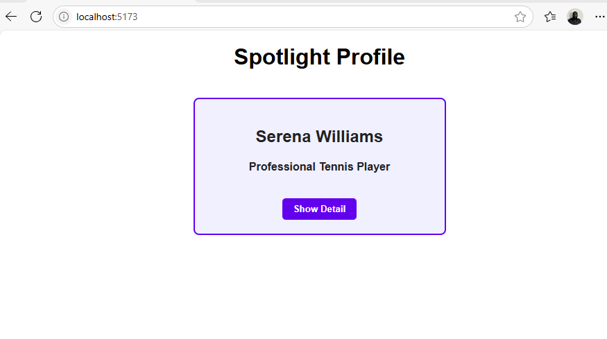
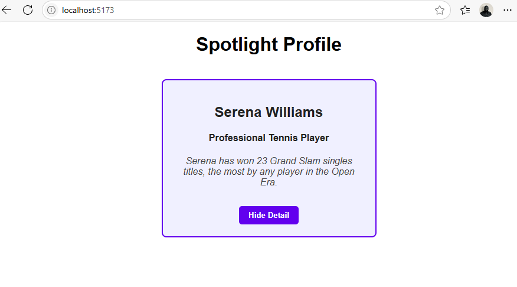

# Profile Component with State and Props

## Description
- This project shows how to use props and state to create an interactive profile component in React.  
- In addition to a button that allows users to toggle visibility of a fun fact or biography, the app displays a stylish profile card with a user's name and occupation.  
- React's `useState` hook controls whether the additional detail is displayed or hidden on the page, while props are used to transfer customizable data from the parent to the profile card.  
- This assignment reinforces key ideas such as modular component design, user-triggered interface changes, and dynamic rendering.
---

## What I Learned
- **Props for customization:**  
- In order for a parent component to pass different content (such as a person's name or interesting fact) into a child Profile component, I learned how to use props.  This facilitates the component's reuse.

- **State for interactivity:**  
- To monitor whether the profile's fun fact (or additional detail) is displayed, I used the `useState` hook.  React demonstrates how to make apps responsive and interactive by allowing state to be changed in response to user actions (such as a button click).

- **JSX and Conditional Rendering:**  
- I discovered how to render content only when specific conditions (such as `showDetail` being `true`) are met by using JSX expressions and conditional statements.  The UI becomes dynamic as a result.

- **Component Styling:**  
- I worked on styling using inline CSS objects, which made it simple to alter the profile card's appearance without using an external stylesheet.

- **Accessibility improvements:**  
- In order for screen readers to reliably report component state (such as whether the additional detail is expanded), I added ARIA attributes to interactive buttons.

---

## Screenshot

